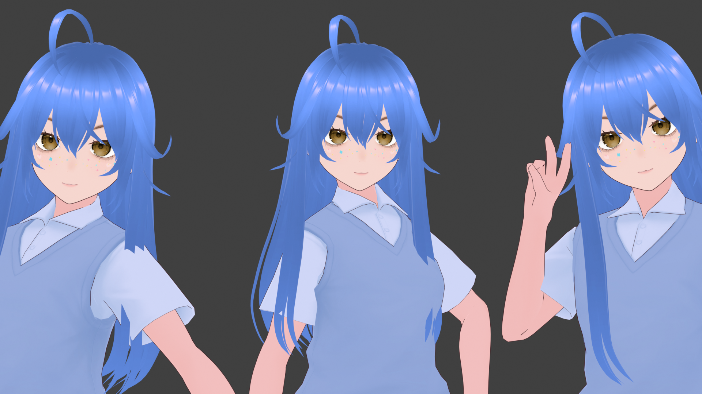

# NikaAI




NikaAI is a virtual anime character you can talk to via text or voice. She responds in real time with a tsundere personality, synced speech, and reactive 3D animations rendered in the browser.

## Features

- **Text & voice input** — chat via a text box, or hold the mic button to speak
- **Speech-to-text** — hold-to-record; audio transcribed server-side with `faster-whisper` (Whisper base model), text sent back to the frontend input bar
- **Text-to-speech** — spoken responses with mouth sync (viseme-based lip sync); custom voice (`voice.safetensors`); disable with `--no-tts` for voice effects only
- **Tsundere personality** — short, dismissive, sarcastic replies defined via system prompt, fully customizable
- **JSON-driven animations & expressions** — the AI responds with structured JSON (`{"response", "animation", "expression", "model"}`) that drives character animations and facial expressions directly.
- **AI-driven VRM model switching** — the AI can request a VRM avatar switch via the `model` field in its JSON response, in addition to manual switching
- **Cursor-tracking eyes and head** — gaze follows the mouse in real time with spring physics; head naturally follows eye movement; eyes look at input bar when typing
- **Head-locked camera** — camera aims at the head bone so it stays centered as the character moves; right-drag to orbit, scroll to zoom in/out
- **Settings panel** — toggle in the bottom-left corner for manual model switching, mouse-tracking on/off, reaction to touch on/off, and VRM reload
- **Touch reactions** — click/tap the model's hair or face to trigger random voiced reactions with audio and angry expression
- **Auto-blinking** — natural random blink intervals
- **Thinking & idle animations** — plays `thinking.vrma` while AI processes; loops `idle.vrma` by default
- **Plug-and-play models & animations** — VRM models are auto-detected from `assets/models/<name>/model.vrm` with optional `metadata.json`; VRMA animations from `assets/vrma/` at startup; no manual registration required for models to appear in the selection menu
- **Session memory** — conversation context persists server-side in `backend/context.json` (max 50 messages)
- **Model activation delay** — 400ms delay before showing model after load (prevents pop-in)
- **Response cloud** — speech bubble next to the character's head showing: greeting on load ("Hi, I'm Nika"), "Nika is thinking..." while AI processes, AI responses, and voiced reactions when touching hair/face
- **Stack** — Python backend (WebSocket on 8766, optional FastAPI STT on 8000), Three.js + `@pixiv/three-vrm` frontend, `Pocket-tts` for TTS, `faster-whisper` for STT

## Requirements

- Python 3.10 (required for torch/onnxruntime compatibility)
- Node.js / npm

## Installation

### Windows

```bash
npm install
py -3.10 -m venv .venv
.venv\Scripts\activate
pip install -r requirements.txt
```

### Linux/macOS

```bash
npm install
python3.10 -m venv .venv
source .venv/bin/activate
pip install -r requirements.txt
```

### Create a `.env` file in the project root:

```env
API_KEY=your_api_key
BASE_URL=your_base_url
MODEL=your_model
```

### Add models:

Place VRM files in `assets/models/<name>/model.vrm` (e.g. `assets/models/nika/model.vrm`). Optional `metadata.json` in the same folder can provide additional info.

### Add animations:

Drop `.vrma` files into `assets/vrma/` (e.g. `assets/vrma/idle.vrma`).

### Launch the app:

**Recommended:**

```bash
run.bat     # Windows
./run.sh    # Linux/macOS
```

**Or launch manually**

#### Windows

```bash
npx vite
.venv\Scripts\python.exe backend\main.py
```

#### Linux/macOS

```bash
npx vite
.venv/bin/python backend/main.py
```

## Common Flags

```bash
python backend/main.py --no-tts   # Disable TTS (voice effects only)
python backend/main.py --no-stt   # Disable speech-to-text
```

## License

MIT — do whatever you want with it.